# Ferretry brand marks — three directions to choose from

Three genuinely different logo ideas for Ferretry. **Nothing here is wired into the app.** No
favicon, no manifest icon, no component imports these files — picking one is your call, and a
follow-up unit installs the winner.

Every file is hand-authored SVG: no raster data, no base64 blobs, no font references. The wordmark
letters are drawn as stroked geometry, not text, so a file renders identically on a machine with no
fonts and no network.

---

## At a glance

|                      | **A — retry-loop**                                               | **B — fleet-grid**                                               | **C — monogram**                                               |
| -------------------- | ---------------------------------------------------------------- | ---------------------------------------------------------------- | -------------------------------------------------------------- |
| Light                | 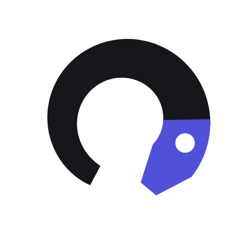          | 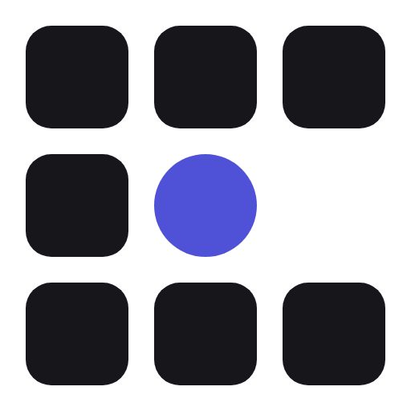          | 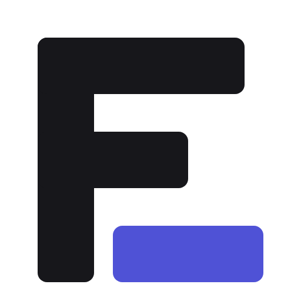          |
| Dark                 | 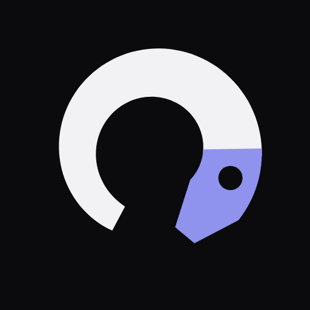     | 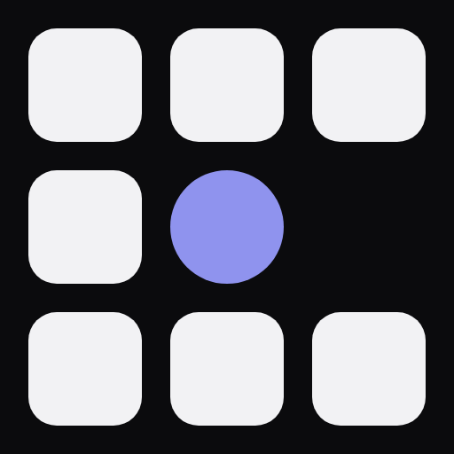     | 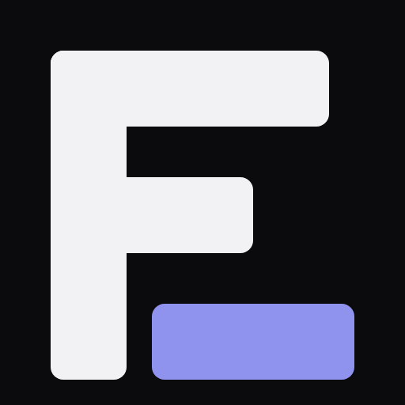     |
| 128 px               |           |           |           |
| **16 px**, magnified |     | 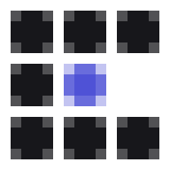    | 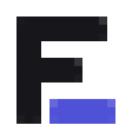    |
| Maskable (PWA icon)  | 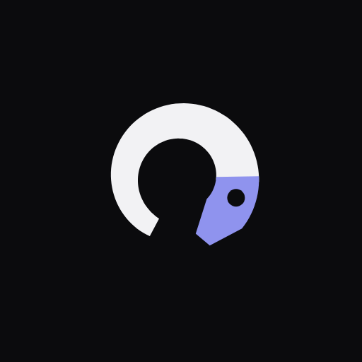 | 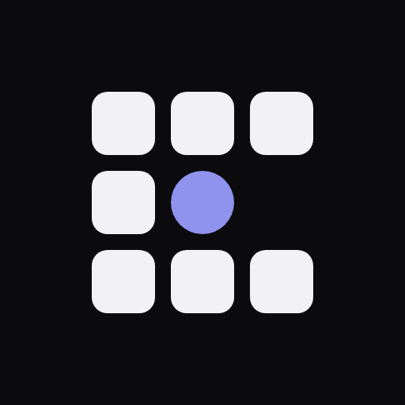 | 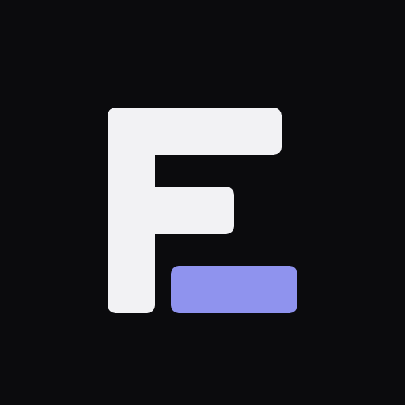 |

The "16 px, magnified" row is the **real 16×16 render**, blown up 12× with nearest-neighbour so you
can see what a browser tab actually gets. It is not a scaled-down 512 px image.

### Wordmarks

**A — retry-loop**

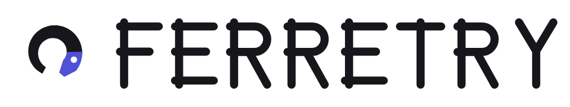
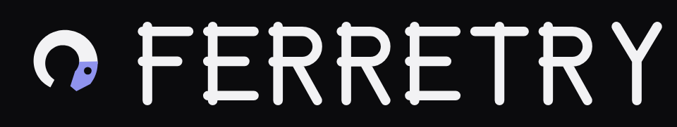

**B — fleet-grid**


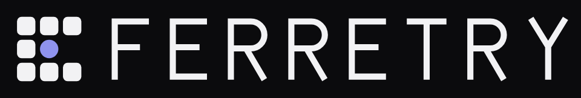

**C — monogram**

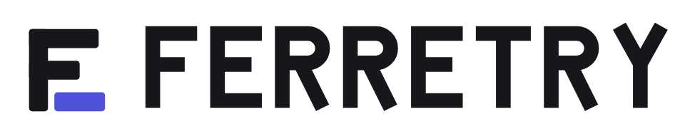
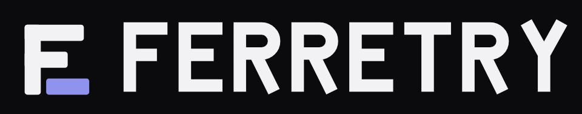

---

## The three ideas

### A — `retry-loop/`

> **A ferret curled into a retry loop** — the tail tapers into the body, the body closes as a ring,
> and the accent head faces the gap it is about to run back through. For the phone: it is the one
> with a face, and the one that carries the name's _ferret + retry_ pun.

Warmest of the three and the most ownable silhouette, but also the softest at 16 px — a curve has no
pixel grid to sit on, so the tail greys out and it reads as a ring with an accent head. Fine as a
home-screen icon, weakest as a favicon.

Type: rounded monoline caps, wide tracking.

### B — `fleet-grid/`

> **A fleet status board**: eight agents around one daemon, with the ninth cell simply _absent_ —
> because Ferretry refuses to draw a healthy square for a report it never received.

The operator's mark. Every edge sits on the 4-unit grid that maps 1:1 onto whole pixels at 16 px, so
it is the crispest of the three at small sizes — and it is the only one whose meaning survives the
shrink, since a missing cell is still obviously missing. The round hub reads as "different kind of
thing" even in the single-colour variant where the accent is gone.

Type: light monoline caps, very wide tracking — a terminal-status feel.

### C — `monogram/`

> **An F whose arms are a stack of agent bars**, the last one detached and running on its own — a
> letter that is also a queue.

The safest and most conventional: a letterform is what browsers, app switchers and README badges
handle best, and it is unmistakable at any size. Least evocative of the three; it says "software
product" more than it says anything about supervision.

Type: heavy caps, tight tracking.

---

## Files in each direction

| File                    | Use                                                                         |
| ----------------------- | --------------------------------------------------------------------------- |
| `logomark.svg`          | Icon alone, **light backgrounds**. Ink `#17171b`, accent `#4f52d6`.         |
| `logomark-dark.svg`     | Icon alone, **dark backgrounds**. Ink `#f2f2f4`, accent `#8f93ee`.          |
| `logomark-mono.svg`     | Single colour via `currentColor` — inline in the app, inherits the theme.   |
| `logomark-maskable.svg` | PWA / Android home screen. Solid `#0b0b0d` field, content in the safe zone. |
| `wordmark.svg`          | Mark + `FERRETRY`, light backgrounds.                                       |
| `wordmark-dark.svg`     | Mark + `FERRETRY`, dark backgrounds.                                        |
| `png/`                  | Renders at 512 / 128 / 16 px, plus the 12× magnified 16 px proof.           |

### Colours

Straight from the app's `studio` theme in `packages/pwa/src/styles/themes.css` — no new palette was
invented:

| Token      | Light (`studio-light`) | Dark (`studio-dark`) |
| ---------- | ---------------------- | -------------------- |
| `--fg`     | `#17171b`              | `#f2f2f4`            |
| `--accent` | `#4f52d6`              | `#8f93ee`            |
| `--bg`     | `#fbfbfc`              | `#0b0b0d`            |

`logomark-mono.svg` is the variant to use where a theme should drive the colour: it paints entirely
with `currentColor`, so it follows whatever `color` the surrounding element resolves to. The trade
is that the accent disappears and, for `retry-loop`, so does the eye — a knocked-out counter needs a
known background colour, and `currentColor` does not give it one.

### Maskable safe zone

Each `logomark-maskable.svg` is a 512 canvas with the mark confined to the centred 320×320 box. The
Android circular crop keeps a 409.6 px circle; the far corners of that box sit 198 px from the
centre, inside the 204.8 px radius, so nothing important is cut — including `fleet-grid`'s corner
cells, which are the tightest case.

---

## How the PNGs were made

Every PNG in this directory was rendered from the committed SVG with headless Chrome at the exact
pixel size named in the filename — never scaled from a larger image:

```
google-chrome --headless --screenshot --window-size=<n>,<n> --force-device-scale-factor=1 <file>.svg
```

Light art is composited onto `#ffffff` and dark art onto `#0b0b0d` so neither vanishes against a
viewer's own theme. The `-at-12x` proofs magnify the real 16 px PNG with `image-rendering: pixelated`.

## What is deliberately not here

- **No favicon, no manifest icon, no app wiring.** `packages/pwa/index.html` still ships without
  `rel="icon"` or `rel="manifest"`, and this change does not touch it.
- **No per-daemon branding.** The daemon's runtime monogram/colour overlay (see
  `docs/migration/surveys/pwa-shape.md`) is a separate, unported capability. These marks are the
  product identity underneath it, not a replacement for it.
- **No icon generation pipeline.** `gen-icons.ts` / `verify-icons.ts` remain unported; whoever
  installs the winning direction owns that.
