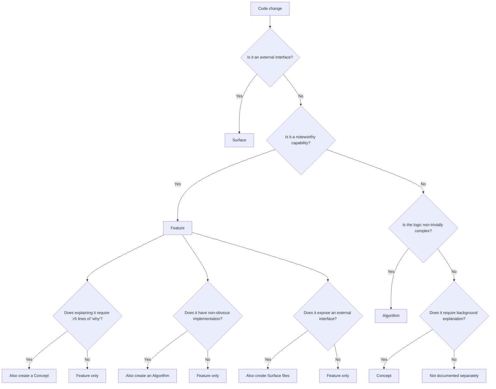

# Classification Heuristics

When analyzing a codebase to generate contributor docs, every change needs to be classified: is it a feature, a concept, an algorithm, a surface, or an ADR? This article provides detailed heuristics.

Examples throughout are drawn from this repository so the heuristics stay concrete.

---

## Decision Flowchart

---

## Feature Heuristics

**Document as a feature when:**

- The capability has interesting mechanics worth commenting on
- A new contributor would benefit from knowing this exists and how it works
- It can be described as "the system does X" or "this module handles X"

This is contributor documentation, not user documentation. Features don't need to be user-visible. Internal mechanisms, implementation strategies, and architectural capabilities all count.

**Examples:**

- Deriving the product and binary names from `package.json` instead of hardcoding them
- Terminal ports (spinner, progress bar, prompt) behind injected interfaces
- Compiling the CLI into standalone binaries per platform
- Dual-driver system integration tests (compiled binary vs in-process)
- Dead-code gating over both the whole repository and the production graph

**Not a feature:**

- Pure boilerplate with no interesting mechanics
- Dependency upgrades with no behavioral change
- Code style changes
- Trivial pass-through wrappers with no noteworthy behavior

---

## Concept Heuristics

**Document as a concept when:**

- Explaining a feature requires more than 5 lines of background or rationale
- There's a meaningful X vs Y comparison that informed the design
- A flow or process spans multiple features and needs its own explanation
- Contributors need prerequisite knowledge to understand the code

**Concept type selection:**

| Type         | Signal                                                       | Example                                             |
| ------------ | ------------------------------------------------------------ | --------------------------------------------------- |
| `comparison` | The code chose between two legitimate alternatives           | "Compiled binary vs published npm package"          |
| `flow`       | Multiple steps across components form a process              | "Commit to tag to published release"                |
| `design`     | A pattern or architecture choice affects multiple features   | "Three-layer separation of domain, adapters, glue"  |
| `prereq`     | Contributors need background knowledge not obvious from code | "Conventional commit types this repository accepts" |

**Concepts can exist without features.** Common standalone concepts:

- Comparisons that inform the overall architecture
- Flows that span the entire system
- Prerequisites for understanding the domain

---

## Algorithm Heuristics

**Document as an algorithm when:**

- The implementation is non-trivially complex (not just a thin wrapper)
- Simpler approaches were tried and rejected
- There are workarounds for known limitations
- The code would be confusing to a new contributor without context
- The "why" is more interesting than the "how"

**Examples:**

- Extracting per-version release notes by diffing the changelog against its pre-release backup
- Resolving a compiled binary's own version without reading `package.json` at runtime
- Ordering the compile and package steps so a clean-up flag cannot delete freshly built artifacts

**Not an algorithm:**

- Straightforward read/write operations
- Simple sorting/filtering
- Standard library usage
- Well-known patterns applied without modification

---

## Surface Heuristics

**Document as a surface when:**

- The change exposes an external interface (CLI command, HTTP endpoint, SDK method, event)
- External consumers need to know the contract

**Granularity: one file per endpoint/command.**

| Surface Type | One File Per                                  |
| ------------ | --------------------------------------------- |
| CLI          | Command or global flag (e.g., `fy --version`) |
| API          | HTTP endpoint (e.g., `GET /v1/sessions/:id`)  |
| SDK          | Public method or function                     |
| Event        | Event type (e.g., `session.started`)          |

CLI surfaces are the common case today; the daemon and its HTTP/event surfaces arrive with the
later migration phase, and only get surface files once they exist in code.

---

## ADR Heuristics

**Document as an ADR when:**

- A reasonable person could have chosen differently
- The decision affects the system architecture or multiple modules
- The rationale is not obvious from the code
- Reversing the decision later would be expensive

**Examples:**

- Compiling a standalone binary instead of shipping a Node entrypoint
- Deriving the product and binary names from `package.json` instead of a dedicated config file
- Committing the Homebrew cask into this repository instead of maintaining a separate tap repository

**Not an ADR:**

- Choosing a utility library
- Minor implementation choices within a function
- Decisions that are trivially reversible

---

## Module Heuristics

**Group into a module when:**

- The code has a clear bounded context (owns specific domain concepts) — see [Domain-Driven Design](../domain-driven-design/index.md)
- Multiple features share the same domain types or data store
- The code could theoretically be extracted and shipped on its own

**Examples:**

- `terminal-adapters` -- the injected IO ports and their concrete implementations
- `release-pipeline` -- compile, package, publish, install channels
- `nix-toolchain` -- devshell, formatters, pre-commit generation

**Cross-module content** (concepts or algorithms that span multiple modules) goes in `shared/`.
